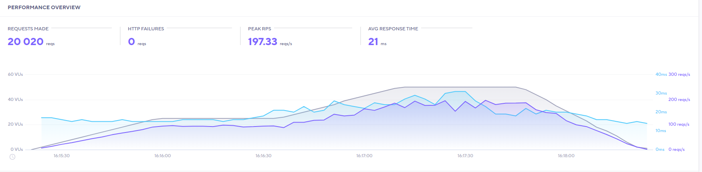

# Products API service

## Building and installing env

First install dependencies:

```sh
npm install
```

To run node server:

```sh
npm start
```

## Tech Stack
* [Node](https://nodejs.org/en/)
* [Express](https://expressjs.com/)
* [Docker](https://www.docker.com/)
* [AWS EC2, Lambda](https://aws.amazon.com/)
* [MongoDB](https://www.mongodb.com/1)
* [Mocha/Chai](https://mochajs.org/)

## Load Testing
This app was build and deployed twice,  once utilizing an AWS EC2 virtual machine, and again using AWS Lambda serverless functions.  The intent was to compare and contrast ease of setup, and performance.

### Serverless Results


### EC2 Results

